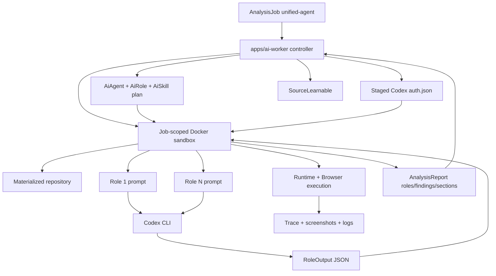

# AI Agent Runtime

The AI worker is the agent-driven execution plane for SpecLens.

## Purpose

`apps/ai-worker` is the long-lived controller for hosted agent jobs. It claims `unified-agent` queue work, builds an immutable execution snapshot, launches a job-scoped Docker sandbox, streams logs, collects the result bundle, and persists the resulting report, changeset, logs, and artifacts.

## Execution Shape

## Role Pipeline

Each agent run:

1. claims a unified-agent hosted job
2. loads the selected `AiAgent`
3. resolves its ordered `AiRole` definitions
4. expands linked `AiSkill` instructions and tool capability hints
5. stages Codex auth from persisted OAuth tokens into the per-job temp root
6. builds an internal sandbox request containing the claimed job, resolved plan, role/skill definitions, source metadata, secrets, learnables, auth path, output root, and timeout policy
7. launches `speclens/ai-agent-sandbox:local` through the shared nested Docker daemon
8. materializes the repository source inside the sandbox, optionally bundling a companion source alongside it
9. executes each role in order inside the sandbox
10. validates the `Standardized JSON handoff` emitted by the universal audit agent
11. executes documented install/start/browser steps from that handoff when they are concrete enough
12. captures runtime logs, browser screenshots, storage state, traces, and any copied Playwright artifacts inside the sandbox output root
13. normalizes role output plus execution evidence into sections/findings, execution coverage, remediation packs, artifact audits, and a release gate
14. writes a structured sandbox result bundle
15. has the controller persist the final report, changeset, artifacts, diagnostics, and learnables

## Universal Audit Bundles

The seeded catalog now exposes 3 canonical bundle agents plus 2 support agents:

- `agent-universal-smoke`
- `agent-universal-standard`
- `agent-universal-exhaustive`
- `agent-remediation-planner`
- `agent-fix-readiness`

The standard and exhaustive bundles follow the same broad phase order:

1. source topology and runtime discovery
2. auth and live-surface mapping
3. license, dependency, architecture, and code-health review
4. component, design-system, copy, accessibility, navigation, browser, visual, and UX review
5. consistency synthesis, artifact expectations, remediation planning, release scoring, and canonical handoff emission

## Role Context

Each role prompt combines:

- role name, id, and prompt
- skill instructions
- granted tool capabilities
- selected prior role outputs
- active source learnables
- the role output contract, including the expected section title and required structured data keys
- repository working directory context

When a paired source run is used, the materialized workspace exposes:

- `primary/` for the main source selected on the job
- `companion/` for the optional linked source
- `speclens-source-bundle.json` describing both inputs

## Runtime Guarantees

- default posture is read-only repo analysis unless granted capabilities require more
- prompts are role-scoped instead of one giant multi-purpose prompt
- outputs are normalized before being persisted
- seeded roles have canonical output contracts; reports include a `Role contract audit` section and quality role scores reflect contract readiness
- canonical runtime/auth/playwright handoffs are treated as executable contracts, not just summaries
- Playwright preflight detects both direct commands and repo-local wrapper scripts, records validation logs under the artifact pipeline, and clears stale repo-native report directories before copying fresh artifacts
- artifact analysis only treats required artifact expectations as release-affecting gaps; optional Playwright outputs remain advisory
- reports carry structured audit metadata including `auditBundleId`, categorized findings, execution coverage, remediation packs, artifact expectations, and a release-gate decision
- execution artifacts are written into the hosted artifact pipeline so the portal can audit what the worker actually observed
- logs are written continuously for live job visibility
- all repository access, Codex execution, shell commands, app/runtime startup, and Playwright work happen inside a job-scoped Docker sandbox
- roles execute through an explicit dependency graph inside the sandbox; independent roles may run concurrently up to `AI_WORKER_ROLE_MAX_CONCURRENCY`, while report sections and findings remain ordered by the agent role list
- runtime/browser/Playwright roles get synthetic graph ordering edges so parallelism does not create dev-server, port, or artifact races
- `AI_WORKER_CODEX_BYPASS_SANDBOX=true` is injected only into the job sandbox so Codex can rely on the outer container boundary

The April 24, 2026 SpecLens self-audit baseline completed the full 22-role standard browser job in 21m16s with `AI_WORKER_ROLE_MAX_CONCURRENCY=4`. The hosted run used safe Playwright verification (`npm run e2e:hosted:local -- --list`), produced ready sandbox evidence, downloaded 57 artifacts, and kept `artifact-auditor` deterministic/native at about 1s instead of the prior 3m59s Codex baseline. The remaining slow roles were `remediation-planner`, `navigation-qa-planner`, `ux-friction-reviewer`, `component-cartographer`, and `code-health-reviewer`; future speed work should target those roles before increasing concurrency.

Shell command execution runs in a killable process group. Timeout handling must terminate the full process tree, not only the shell wrapper, so nested Playwright/npm descendants cannot keep stdout open after timeout.

## Separation From Runner

The AI worker is the active hosted execution runtime.

- hosted analysis and remediation jobs are queued onto the unified agent path
- `runner` remains an isolated deterministic executor surface and historical execution dependency, not a second hosted submission model
- the active hosted product does not expose dual `core` versus `agent` job submission semantics
- local compose and the single-node deploy use a shared `job-dind` daemon for runner and hosted agent sandboxes
- neither `runner` nor `ai-worker` mounts `/var/run/docker.sock`
- `ai-worker` remains the controller; repo work runs inside the one-shot hosted agent sandbox image

## AI Control Plane Entities

| Entity | Purpose |
|---|---|
| `AiAgent` | Named agent definition |
| `AiRole` | Ordered role prompt / execution step |
| `AiSkill` | Reusable instruction block linked to roles |
| `AiAgentRole` | Agent-to-role ordering |
| `AiRoleSkill` | Role-to-skill relationship |
| `AiRoleDependency` | Explicit role dependency graph |
| `AiAuth` | Codex auth/device flow state and encrypted tokens |

## Current Operational Note

The hosted agent sandbox image currently depends on Codex CLI runtime behavior, Playwright browser availability, Docker CLI availability, and local token staging, so changes to:

- Codex auth handling
- output normalization
- role contract shape
- runtime handoff execution semantics
- retry behavior

must be reflected here and in `docs/architecture/auth-and-access.md`.
