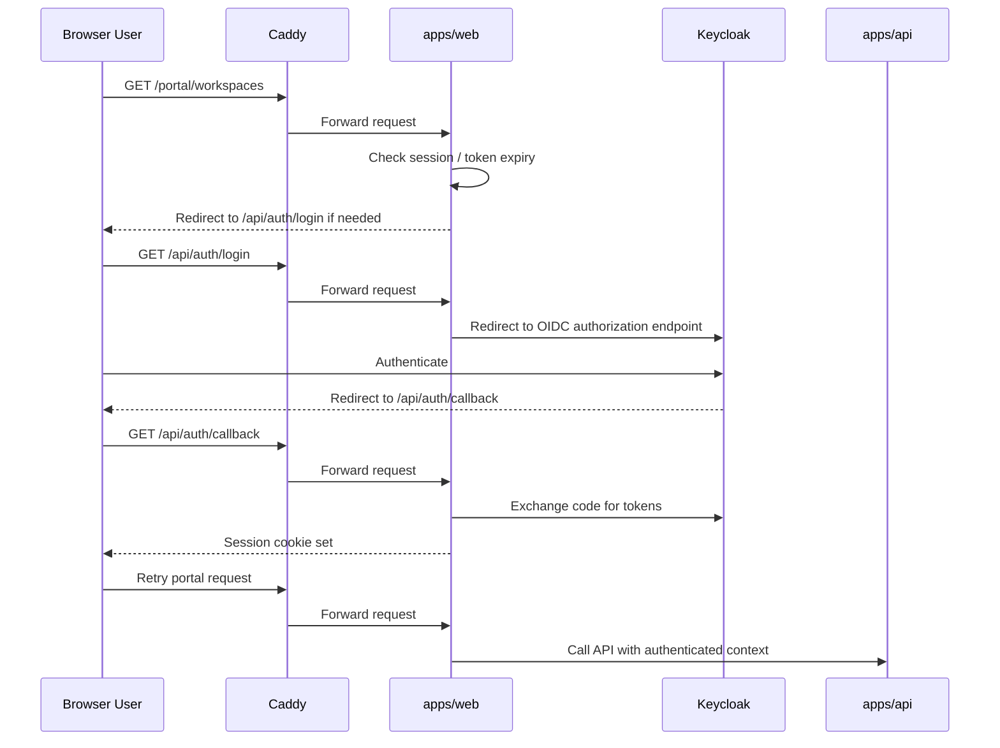
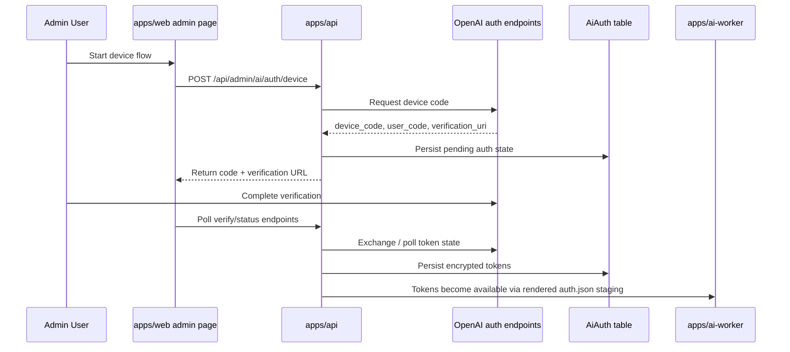
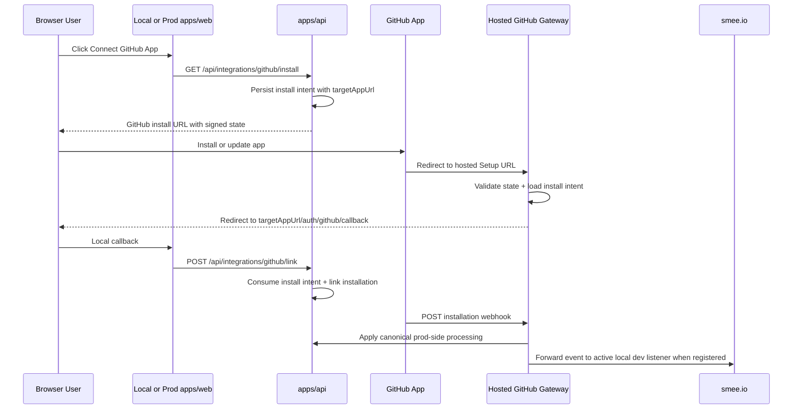

# Auth And Access

SpecLens currently uses Keycloak for hosted authentication in local/dev and the active hosted stack.

## Auth Surfaces

- browser login for the portal
- API bearer-token validation
- admin AI device-flow management for Codex auth
- workspace and user-scoped authorization in the API

## Browser Auth Flow

## API Auth Model

- `apps/web` handles browser-oriented login redirects and session cookies.
- `apps/api` validates the authenticated user on protected routes.
- `/portal/admin/**` and `/api/admin/ai/**` require an authenticated user whose email is allow-listed in `ADMIN_EMAILS`.
- Keycloak issuer validation uses:
  - a public issuer URL for browser-facing flows
  - an internal issuer URL for container-to-container verification

## Admin AI Device Flow

The admin AI panel manages Codex CLI-style OAuth device flow.

## GitHub App Gateway

SpecLens now treats GitHub App install callbacks and webhooks as a hosted gateway concern instead of binding them directly to the current local or production app URL.

Rules:

- GitHub should point only at the hosted gateway host for Setup URL and Webhook URL.
- The browser still returns to the exact host that initiated the install (`localhost`, LAN IP, Tailscale, or prod).
- Local webhook delivery is best-effort and uses the currently registered `smee.io` channel.

## Authorization Model

- all protected API actions resolve a current authenticated user
- workspace-scoped operations are checked against membership or ownership
- portal admin allow-list access is limited to `/portal/admin/**` and `/api/admin/ai/**`; it does not bypass workspace-owner checks for remediation or other workspace mutations
- admin AI flows require explicit admin allow-list membership through `ADMIN_EMAILS`
- job, report, source, and secret access are always user/workspace mediated through the API

## Sensitive Material

- browser sessions are cookie-based through `apps/web`
- Codex tokens are stored in `AiAuth` and staged into worker-local auth files for execution
- workspace secrets are encrypted at rest in `WorkspaceSecret`
- only workspace owners may attach stored workspace secrets to new hosted analysis jobs

## Practical Rule

When changing:

- login URLs
- callback URLs
- Keycloak hostname/base URL behavior
- token persistence
- admin AI auth routes

update this file and `docs/architecture/local-dev-stack.md`.
