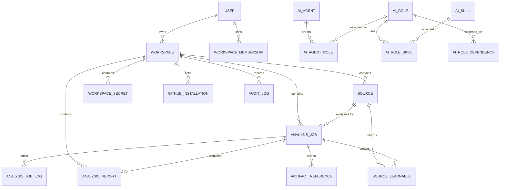

# Data Model

This document summarizes the main product entities rather than every Prisma field.

## Domain Overview

## Product Entities

| Entity | Purpose |
|---|---|
| `User` | Identity, email, display name, entitlement |
| `Workspace` | Tenant-like collaboration container |
| `WorkspaceMembership` | User membership and role in a workspace |
| `Source` | Analyzable Git-backed hosted input: public repo URL, private GitHub repo, or uploaded Git archive |
| `AnalysisJob` | Durable execution record, routing state, and optional paired-source linkage |
| `AnalysisJobLog` | Live and historical execution logs |
| `AnalysisReport` | Persisted report with summary, sections, and findings |
| `ArtifactReference` | Stored outputs associated with a job/report |
| `WorkspaceSecret` | Encrypted workspace-scoped secrets |
| `GithubInstallation` | GitHub App linkage to a workspace |
| `GithubInstallIntent` | Signed install intent backing the hosted GitHub callback gateway |
| `GithubWebhookTarget` | Registered webhook fanout target for production or local development |
| `SourceLearnable` | Reusable observations extracted from prior analysis |

## AI Control Plane Entities

| Entity | Purpose |
|---|---|
| `AiAgent` | Agent definition selected for unified-agent hosted jobs |
| `AiRole` | Role step with prompt and console visibility |
| `AiSkill` | Reusable instruction / tool capability bundle |
| `AiAgentRole` | Ordered membership of roles within an agent |
| `AiRoleSkill` | Ordered membership of skills within a role |
| `AiRoleDependency` | Role-to-role dependency edges |
| `AiAuth` | Stored device flow state and encrypted Codex tokens |

## Analysis Report Shape

Reports are role-based.

- `rolesJson` snapshots the role set used for that run
- `sectionsJson` stores persisted sections keyed by `roleId`
- `findingsJson` stores persisted findings keyed by `roleId`

This lets:

- core and agent reports render through a shared report surface
- the system preserve the exact role configuration used at report time

## Billing And Audit

| Entity | Purpose |
|---|---|
| `BillingSubscription` | Long-lived billing subscription state |
| `CheckoutSession` | Billing checkout attempt/session |
| `StripeEvent` | Processed webhook dedupe and event tracking |
| `AuditLog` | Operator/user action trail |
| `CommercialContactRequest` | Commercial licensing/contact lead capture |

## Source Of Truth

The authoritative schema is:

- `packages/db/prisma/schema.prisma`

Update this doc when:

- adding a new top-level product entity
- changing job/report ownership or cardinality
- changing the AI agent control plane
- changing how primary and companion sources are paired on jobs
- changing how reports are keyed or serialized
