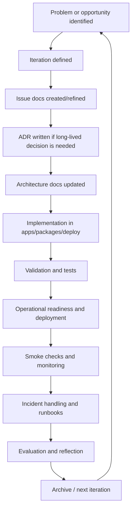

# Governance And Delivery Cycle

This document explains how SpecLens is governed, documented, implemented, validated, and operated over time.

It is intended to help readers understand not just the software architecture, but also the engineering process around the product. That makes it useful for a bachelor report, where the project must usually be explained as both:

- a technical artifact
- a managed development process

## Why These Artifact Types Exist

SpecLens uses several documentation and governance elements because one document type is not enough to explain a real software system.

Different artifacts answer different questions:

- What problem are we solving now?
- What long-lived decision did we make?
- How is the system structured today?
- What work is currently in progress?
- How do we operate the system safely?
- How do we deploy or verify it repeatably?
- How do we know a change actually works?

## Artifact Types And Their Purpose

| Artifact | Purpose | Typical question it answers | SpecLens examples |
|---|---|---|---|
| `README.md` | Entry point to the project | What is this system and where do I start? | `README.md` |
| `AGENTS.md` | Contributor working rules and repo conventions | How should work be performed in this repo? | `AGENTS.md` |
| Architecture docs | Describe the current structure of the system | How does the system work right now? | `docs/architecture/*.md` |
| Iteration docs | Describe a milestone or Design Science cycle | What was the goal of this development phase? | `docs/iterations/ITERATION-005-behavioral-parity-migration.md` |
| Issue docs | Track one objective, backlog item, or root cause while work is active | What concrete problem are we solving now? | `docs/issues/*.md` |
| ADRs | Record architecture decisions intended to last | Why was this solution chosen over alternatives? | `docs/adr/*.md` |
| Runbooks | Human operational instructions for incidents or recurring ops work | What should an operator do when something breaks? | `docs/ops/incident-runbooks.md` |
| Playbooks | Executable automation, usually for deployment or verification | How do we run an environment or operation repeatably? | `deploy/digitalocean/ansible/playbooks/*.yml` |
| Readiness / smoke checklists | Operational release criteria and post-deploy verification | Are we safe to release and is the system healthy? | `docs/ops/production-readiness.md`, `docs/ops/production-smoke-checklist.md` |
| Scaling guidelines | Operational advice for growth and load | How should the system be scaled safely? | `docs/ops/scaling-guidelines.md` |
| Validation commands and tests | Technical proof that the system works | What evidence shows that the implementation passes? | `npm run validate:local`, `npm run test`, `npm run e2e:hosted` |
| Archive docs | Historical evidence from earlier project phases | What changed across iterations, and what was kept as evidence? | `archive/`, `docs/archive/` |

## Short Definitions You Can Reuse In The Thesis

### Iteration

An iteration is a milestone-level development cycle. In SpecLens, an iteration describes:

- the problem framing
- the objectives
- the planned artifact changes
- the demonstration plan
- the evaluation plan
- the results
- the reflection

This aligns well with a Design Science or artifact-oriented bachelor project structure.

### Issue Doc

An issue doc is a focused work item. It is more concrete and more short-lived than an iteration doc.

It answers:

- what specific problem is being worked on
- what scope belongs to that problem
- how progress should be tracked while the work is active

### ADR

An Architecture Decision Record explains a decision that should remain understandable later, even after the original discussion is gone.

An ADR typically captures:

- context
- decision
- consequences
- the iteration that introduced it

This is important in a thesis because it shows that the architecture did not emerge randomly; it was chosen deliberately.

### Runbook

A runbook is a human-readable operational instruction set for handling incidents or recurring support tasks.

Example questions:

- What should we do if jobs stop draining from the queue?
- What do we check if storage fails?
- How do we respond to a provider outage?

Runbooks are about safe human response.

### Playbook

A playbook is an executable or semi-executable automation recipe, usually for deployment or environment control.

In SpecLens, the clearest example is Ansible playbooks under:

- `deploy/digitalocean/ansible/playbooks/`

Playbooks are about repeatable automation.

### Checklist

A checklist is a release or operations control mechanism. It reduces the chance that teams forget critical validation steps.

In SpecLens there are two especially important ones:

- production readiness checklist: what must be true before the system is considered production-ready
- production smoke checklist: what must be manually/operationally verified after deployment

## Runbook Vs Playbook

This distinction is often worth stating clearly in the report.

| Term | Primary user | Purpose | SpecLens example |
|---|---|---|---|
| Runbook | Human operator | Step-by-step response to incidents or operational scenarios | `docs/ops/incident-runbooks.md` |
| Playbook | Automation/deployment tool or operator running automation | Execute a repeatable procedure automatically | `deploy/digitalocean/ansible/playbooks/e2e.yml` |

In short:

- runbook = what people should do
- playbook = what automation should do

## End-To-End Governance And Delivery Cycle

The SpecLens cycle can be described like this:

## What This Cycle Looks Like In Practice

### 1. Problem Framing

The team identifies a limitation, risk, or opportunity.

Example:

- the hosted TypeScript version had cleaner architecture but weaker analysis coverage than the archived system

This is then captured at iteration level.

### 2. Iteration Definition

An iteration doc defines the milestone.

For example:

- `docs/iterations/ITERATION-005-behavioral-parity-migration.md`

This document explains:

- the problem
- the objectives
- what must change
- how the result will be demonstrated
- how it will be evaluated

### 3. Scoped Active Work

Issue docs break the iteration into manageable objectives or root-cause tracks.

Examples:

- `docs/issues/behavioral-parity-migration.md`
- `docs/issues/keycloak-provider-storage-dev-mode.md`

This provides short-to-medium-term traceability for active work.

### 4. Architectural Decision-Making

If the work requires a long-lived technical choice, an ADR is added.

Examples:

- `docs/adr/ADR-0005-behavioral-parity-on-hosted-typescript-architecture.md`
- `docs/adr/ADR-0006-keycloak-provider-registry-and-portable-dev-stack.md`

This step is important because not every issue becomes an architecture decision. ADRs are only for decisions that should remain stable and explainable.

### 5. Architecture Documentation

Once the direction is known, the current structure is documented.

Examples:

- `docs/architecture/system-overview.md`
- `docs/architecture/job-execution.md`
- `docs/architecture/ai-agent-runtime.md`
- `docs/architecture/auth-and-access.md`
- `docs/architecture/data-model.md`

This shows the “current truth” of the system.

### 6. Implementation

The design is implemented in the active codebase.

Main implementation surfaces:

- `apps/web`
- `apps/api`
- `apps/runner`
- `apps/ai-worker`
- `packages/core`
- `packages/contracts`
- `packages/db`
- `deploy/digitalocean`

### 7. Validation

Implementation is not considered complete without verification.

Common validation evidence includes:

- `npm run validate:local`
- `npm run typecheck`
- `npm run test`
- `npm run e2e:hosted`

This gives technical evidence that the artifact works.

### 8. Operationalization

Once functionality works, the system must also be operable.

That is where these artifacts matter:

- `docs/ops/production-readiness.md`
- `docs/ops/production-smoke-checklist.md`
- `docs/ops/scaling-guidelines.md`
- `docs/ops/incident-runbooks.md`
- Ansible playbooks under `deploy/digitalocean/ansible/playbooks/`

This stage answers:

- can the system be deployed?
- can it be observed?
- can it be scaled?
- can incidents be handled?

### 9. Operation And Incident Response

After deployment, the project is not “finished”; it is operated.

If something fails:

- check metrics and readiness
- follow runbooks
- apply automated or scripted recovery where appropriate
- verify recovery with smoke checks

This is especially important for a hosted SaaS like SpecLens.

### 10. Evaluation And Reflection

At the end of the cycle, the team evaluates:

- did the objectives succeed?
- what evidence supports that?
- what limitations remain?
- what should the next iteration focus on?

That reflection is captured in the iteration doc and feeds the next cycle.

## Traceability Example

One of the strengths of this structure is traceability across documents.

A simplified trace might look like this:

1. Iteration:
   `docs/iterations/ITERATION-005-behavioral-parity-migration.md`
2. Issue:
   `docs/issues/behavioral-parity-migration.md`
3. ADR:
   `docs/adr/ADR-0005-behavioral-parity-on-hosted-typescript-architecture.md`
4. Architecture docs:
   `docs/architecture/system-overview.md`
   `docs/architecture/job-execution.md`
5. Implementation:
   `apps/api`, `apps/runner`, `packages/core`
6. Validation:
   `npm run validate:local`
7. Operations:
   `docs/ops/production-readiness.md`
   `docs/ops/incident-runbooks.md`

This is a strong thing to show in a bachelor report because it demonstrates disciplined engineering, not only coding.

## What Should Be Explained In The Bachelor Report

To avoid missing vital parts, the report should usually explain all of these categories.

### 1. Problem And Motivation

- What problem SpecLens addresses
- Why spec-driven / repo-analysis / hosted execution matters
- Why the current iteration was necessary

### 2. Artifact Types And Governance

- what iterations are
- what issue docs are
- what ADRs are
- what architecture docs are
- what runbooks and playbooks are
- what checklists are used for

### 3. Technical Architecture

- web, API, runner, AI worker
- database and queue
- auth
- storage
- deployment topology

### 4. Development Method

- how work moves from problem framing to implementation
- how long-lived decisions are documented
- how evidence and validation are captured
- how archived iterations are kept as historical evidence

### 5. Operational Model

- how the system is deployed
- how it is monitored
- how failures are handled
- how readiness and smoke checks work

### 6. Validation And Evaluation

- what commands/tests are used
- what counts as evidence
- how success is evaluated

### 7. Reflection And Limitations

- what remains incomplete
- what tradeoffs were accepted
- what the next iteration should improve

## Suggested Thesis Section Structure

If useful, this can map into a bachelor report chapter structure like:

1. Introduction and problem context
2. Method and development process
3. System architecture
4. Governance artifacts and traceability
5. Implementation
6. Validation and evaluation
7. Operations and deployment
8. Reflection, limitations, and future work

## Practical Advice

If you are unsure whether something belongs in the report, ask:

- Does this artifact change how the system is built?
- Does it change how decisions are justified?
- Does it change how the system is validated?
- Does it change how the system is operated?

If the answer is yes, it probably deserves at least a short explanation in the report.
