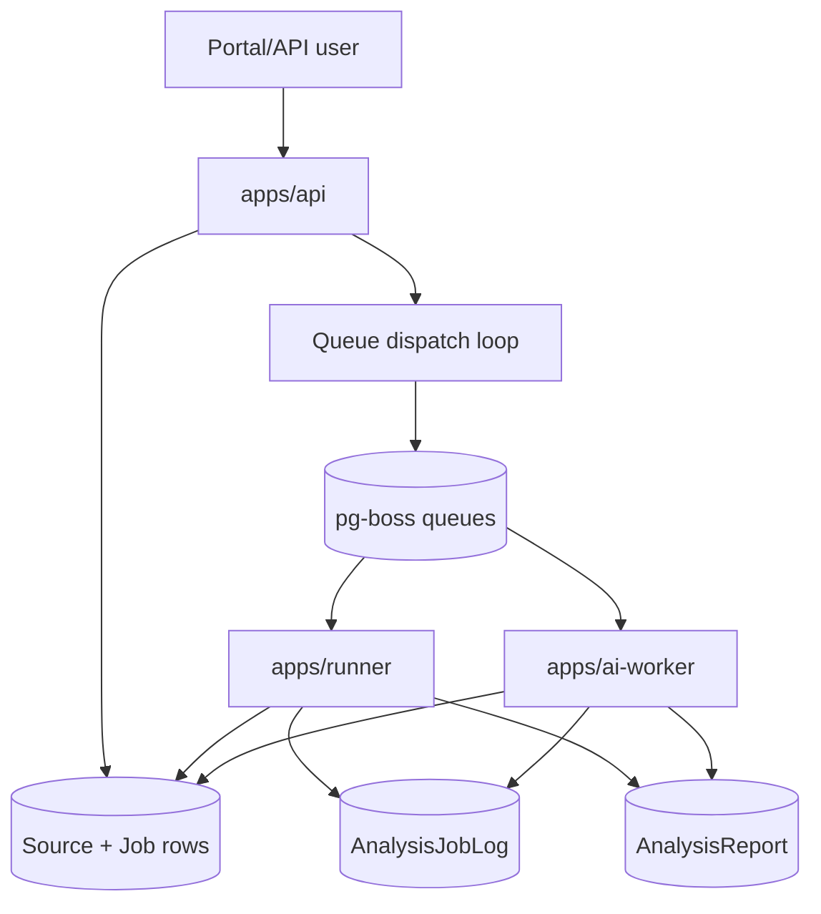
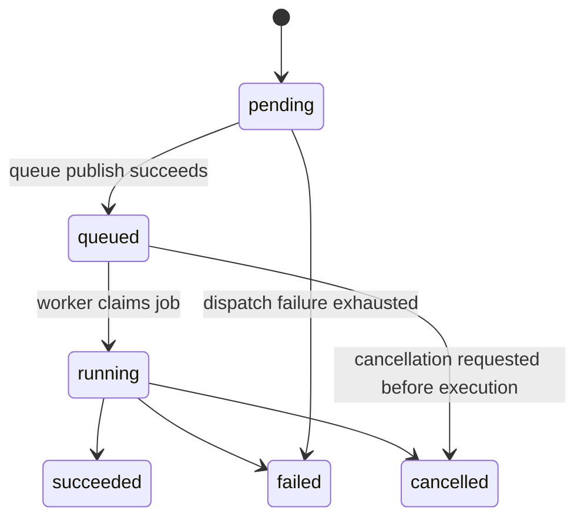

# Job Execution

SpecLens uses durable queued job execution backed by PostgreSQL and `pg-boss`.

## Core Flow

## Queue Ownership

| Engine | Queue | Worker |
|---|---|---|
| `core` | `analysis-jobs` | `apps/runner` |
| `agent` | `ai-agent-jobs` | `apps/ai-worker` |

## Lifecycle

## Dispatch Separation

The API does not execute long-running analysis inline.

Instead it:

1. creates `AnalysisJob`
2. persists source/job metadata, including an optional companion source
3. leases the job for dispatch
4. publishes a queue message containing `jobId`
5. lets the correct worker claim and execute it

For unified-agent hosted jobs, execution now has two phases:

1. Codex-driven role synthesis
2. worker-side runtime and browser execution based on the canonical handoff

For universal audit bundles, the persisted report also includes:

- categorized findings across code, dependency, license, auth, UX, visual, accessibility, copy, navigation, consistency, artifact, docs, and ops domains
- execution coverage describing attempted and skipped runtime/browser steps
- remediation packs grouped for downstream fix execution
- an artifact audit against expected report and browser outputs
- a release-gate decision with confidence and blocking findings

If an AI-agent job fails or is cancelled before a report is available, the worker still replays its duplicate-safe in-memory log timeline into finalization and uploads `jobs/{jobId}/agent-failure.json` as a `runtime-log` artifact. The diagnostic artifact contains the status, failure reason, execution steps, and logs needed to review the interrupted role chain.

## Paired Sources

A job still has one primary `sourceId`, but it can also persist one optional companion source.

When a companion source is present:

- workers materialize both inputs
- SpecLens builds a combined temp workspace
- the primary input is mounted under `primary/`
- the companion input is mounted under `companion/`

This supports cases like:

- public Git repository + private GitHub repository
- uploaded Git archive + public Git repository
- uploaded Git archive + supporting private GitHub repository

## Why This Matters

- browser/API latency stays low
- retry and cancellation state are persisted
- core and agent execution can scale independently
- queue transport is durable because `pg-boss` state lives in PostgreSQL
- agent jobs can now produce concrete runtime and browser evidence instead of stopping at planning-only output

## Persistence Interfaces

The queue message is intentionally small.

- transport payload: usually just `{ jobId }`
- business state: `AnalysisJob`, `AnalysisJobLog`, `AnalysisReport`, `ArtifactReference`

## Cancellation And Retry

- jobs can be marked for cancellation in persistent state
- dispatch failures record attempt counts and next retry timestamps
- workers append logs during execution so the portal can stream or poll live status

## Related Files

- `packages/db/src/queue.ts`
- `packages/db/src/repositories.ts`
- `apps/api/src/routes/durable.ts`
- `apps/runner/src/services/runner.ts`
- `apps/ai-worker/src/services/worker.ts`
