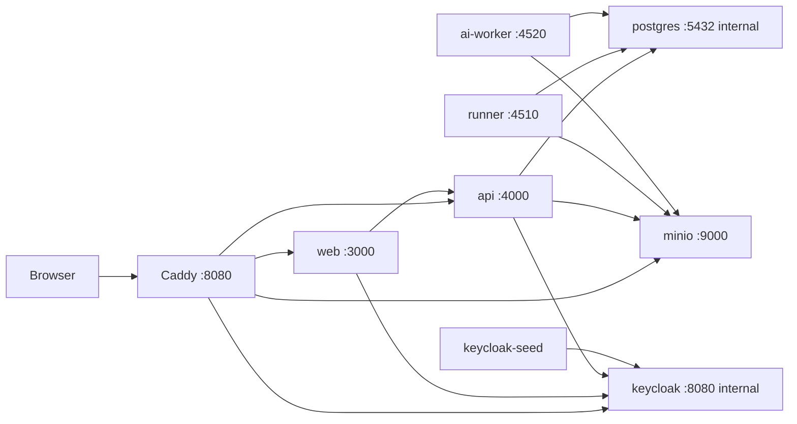

# Local Dev Stack

This document describes the default Docker Compose topology used for local development.

## Compose Topology

## Public Entry Points

In local Compose, Caddy is the browser-facing entry point.

Typical public URLs:

- app root: `http://<host>:8080`
- portal: `http://<host>:8080/portal`
- Keycloak public path: `http://<host>:8080/auth`
- MinIO object proxy: `http://<host>:8080/minio/*`

## Route Shape

| Public path | Upstream |
|---|---|
| `/` | `web:3000` |
| `/api/*` | `api:4000` except Next-managed auth/proxy paths |
| `/api/auth/*` | `web:3000` |
| `/api/proxy/*` | `web:3000` |
| `/auth/*` | `keycloak:8080` via stripped `/auth` prefix |
| `/minio/*` | `minio:9000` |
| `/minio-console/*` | `minio:9001` |

## Startup Notes

- `workspace-deps` installs root `node_modules`
- `api` runs Prisma generation and migrations on boot
- `keycloak-seed` updates the portal client and local test users
- `runner` and `ai-worker` are optional for UI-only work, but required for end-to-end analysis

## Tailscale / Remote Access

For remote access from another machine:

- use the host machine’s Tailscale IP or MagicDNS name
- set `APP_URL`, `API_URL`, `NEXT_PUBLIC_API_URL`, `KEYCLOAK_ISSUER_URL`, and `KEYCLOAK_BASE_URL` to that public host
- keep `GITHUB_ALLOWED_RETURN_ORIGINS` aligned with any non-default LAN/Tailscale host you want the hosted GitHub gateway to redirect back to
- keep Caddy on `0.0.0.0:${CADDY_HTTP_PORT}`

## Operator Rule

If Docker Compose service names, ports, reverse-proxy routes, or public URLs change, update this document and `docs/architecture/auth-and-access.md`.
