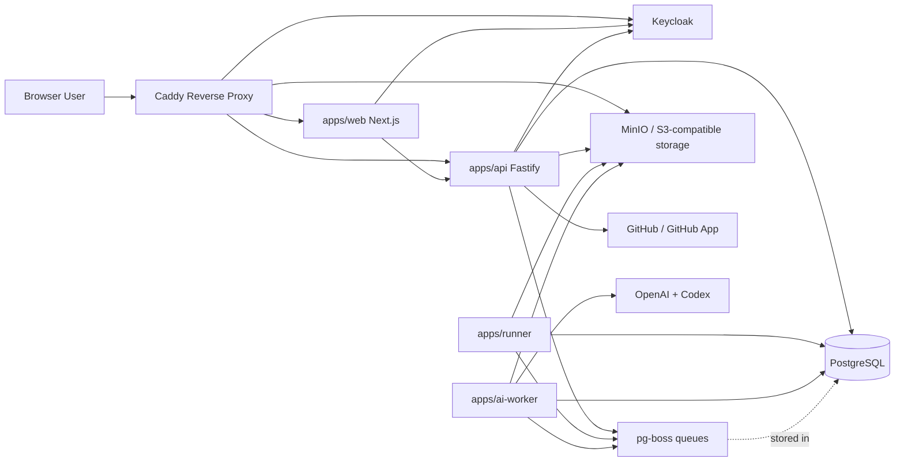

# System Overview

This document describes the active SpecLens hosted architecture in Iteration 5.

## Purpose

SpecLens is a hosted SaaS for repository analysis with:

- a public marketing and portal surface
- a Fastify control plane
- queue-driven analysis execution
- separate `runner` and `ai-worker` services
- PostgreSQL-backed product state and durable queues
- S3-compatible artifact storage
- Keycloak-based identity

## Top-Level Runtime

## Active Service Responsibilities

| Service | Responsibility |
|---|---|
| `apps/web` | Marketing pages, portal, auth handoff, admin UI, report rendering |
| `apps/api` | Product API, job creation, billing/webhook surfaces, auth/session enforcement, admin AI controls |
| `apps/runner` | Isolated deterministic sandbox support for internal execution helpers |
| `apps/ai-worker` | Unified hosted audit/remediation controller that runs repo work inside one-shot agent sandboxes |
| `packages/core` | Shared analysis logic, browser/runtime helpers, and archived parity reference behavior |
| `packages/db` | Prisma schema, repositories, queue helpers, token persistence |
| `packages/contracts` | Zod-based DTOs and report/job contracts |

## Architectural Boundaries

- `web` is presentation and session-aware orchestration, not the system of record.
- `api` owns business operations, persistence coordination, queue dispatch, and external integrations.
- `runner` and `ai-worker` are sibling execution planes, not parent/child services.
- PostgreSQL stores both product state and the `pg-boss` durable queue state.
- reports are persisted and rendered after execution; they are not assembled only in-memory.

## Primary Execution Mode

| Mode | Execution path | Worker |
|---|---|---|
| Hosted audit and remediation | `unified-agent` | `apps/ai-worker` |

## Key Design Point

SpecLens is intentionally split into:

- a control plane: `web` + `api`
- execution planes: `runner` + `ai-worker`
- shared persistence and contracts: `packages/db` + `packages/contracts`

That split keeps user-facing workflows responsive while long-running analysis is handled asynchronously.
